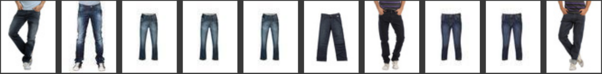
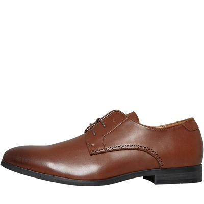
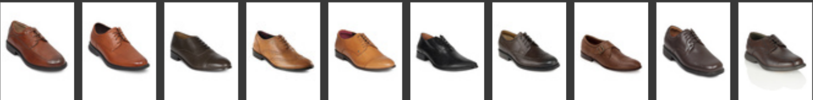

# Multimodal Search Engine

## Description
This project implements a **multimodal search engine** capable of searching for fashion products based on both **text** and **image** queries.</br>
It leverages **CLIP** embeddings for dense similarity search, allowing users to retrieve relevant clothing items by entering either a text description or uploading an image of a product.</br>
The search engine is built using a fashion product dataset and intended to be used in e-commerce and recommendation systems.

## Project Structure Overview
The project was developed using the [Fashion Product Images Dataset](https://huggingface.co/datasets/ashraq/fashion-product-images-small). The implementation is housed in the `MultiModal Search Engine.ipynb` notebook.

Here’s an overview of the key components:
 * **Dataset**: Load and preprocess the fashion product dataset from Hugging Face.
 * **Dense Embeddings**:  Generate dense embeddings with `CLIP (ViT-B/32)` for fashion product images. These embeddings are used for both text and image search.
 * **Search Functionality**:
     - **Text Search**: Encodes the user’s query and compares it to the dense embeddings using cosine similarity.
     - **Image Search**: Encodes the image with CLIP, and retrieves similar products by comparing dense embeddings using cosine similarity.
 * **Result Visualization**: Displays the `top K` most relevant product images based on the search query.

## Features
 * **Multimodal Search**: Accepts both text and image-based queries, providing a flexible search solution.
 * **Dense Retrieval with CLIP**: Uses **CLIP embeddings** to perform accurate search by computing cosine similarity between the query and fashion product embeddings.
 * **User-Friendly Visualization**: Displays the retrieved images in an intuitive and responsive format.

## Usage
```python
query = "...."
dense_query = model.encode(query)[np.newaxis,...]
dense_scores = cosine_similarity(dense_query, dense_embeds).flatten()
top_indices = np.argsort(dense_scores)[-10:][::-1]
top_results = fashion.select(top_indices)
display_result(top_results)
```

**Image based serach**
```python
query_image = Image.open('path_to_image.jpg')
dense_query = model.encode(query_image)[np.newaxis,...]
dense_scores = cosine_similarity(dense_query, dense_embeds).flatten()
top_indices = np.argsort(dense_scores)[-10:][::-1]
top_results = fashion.select(top_indices)
display_result(top_results)
```

## Visuals
### Example text search
```python
query = "dark blue french connection jeans for men"

```
**Result**


### Example image search


**Result**


